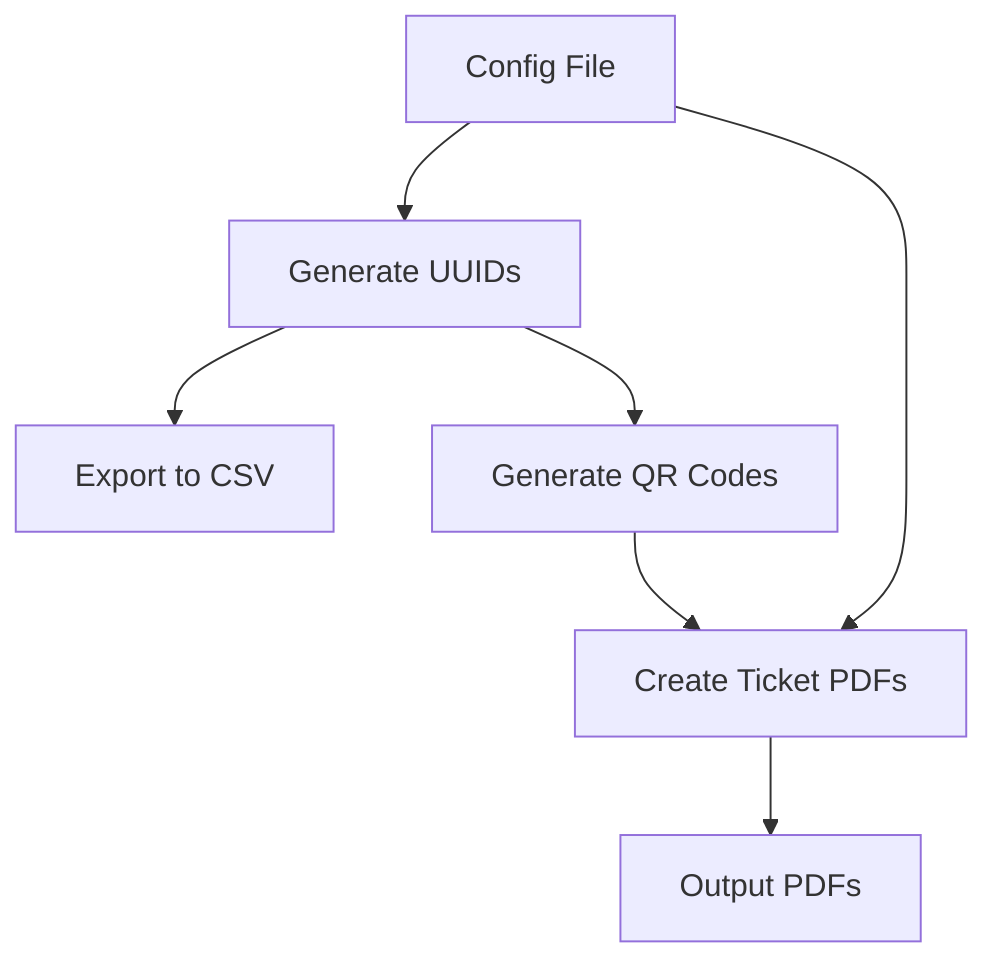

# QR Ticket Generator - Implementation Plan

## Overview

Build a TypeScript Node.js application that generates concert tickets with QR codes. The process: generate UUIDs → export CSV → create QR codes → generate PDF tickets (A7 format, max 20 per PDF).

## Architecture




## Project Structure

```javascript
qr-print/
├── package.json
├── tsconfig.json
├── .gitignore
├── config/
│   └── ticket-config.json (template)
├── src/
│   ├── index.ts (main entry point)
│   ├── generateIds.ts
│   ├── exportCsv.ts
│   ├── generateQRCodes.ts
│   ├── createTicketPDF.ts
│   ├── types.ts
│   └── utils.ts
├── output/
│   └── {ArtistName}_{Date}/
│       ├── ids.csv
│       └── tickets/
│           ├── tickets-001.pdf
│           ├── tickets-002.pdf
│           └── ...
└── README.md
```


## Implementation Details

### 1. Boilerplate Setup

- Initialize Node.js project with TypeScript
- Configure `tsconfig.json` with strict mode
- Set up package.json with scripts for build/run
- Create output directory structure

### 2. Dependencies

- `qrcode` + `@types/qrcode` - QR code generation
- `pdfkit` + `@types/pdfkit` - PDF creation with image embedding
- `csv-writer` - CSV export
- `typescript` + `tsx` - TypeScript support and execution
- `@types/node` - Node.js types

Note: Use Node.js built-in `crypto.randomUUID()` for UUID generation (no external package needed)

### 3. Configuration System

- Create `config/ticket-config.json` with:
- Ticket count
- Event details (artist, date, starttime, venue, ticket category)
- Optional seat info template
- Static text field
- Load config at startup with validation
- Layout is hardcoded in `createTicketPDF.ts` (no config needed)

### 4. Core Modules

**`src/types.ts`**

- Define TypeScript interfaces for:
- `TicketConfig` - configuration structure
- `TicketData` - individual ticket data (ID + event info)
- `QRCodeBuffer` - QR code image buffer

**`src/generateIds.ts`**

- Function to generate array of UUIDs using Node.js built-in `crypto.randomUUID()`
- Configurable count from config file
- Return array of strings

**`src/exportCsv.ts`**

- Export generated IDs to CSV file
- Include headers: ID, Artist, Date, StartTime, Venue, Category, Seat (if applicable)
- Save to `output/{ArtistName}_{Date}/ids.csv` (folder created based on artist and date from config)

**`src/generateQRCodes.ts`**

- For each ID, generate QR code as PNG buffer using `qrcode` library
- Store in memory (no need to save individual files)
- Return map/array of ID → QR code buffer pairs

**`src/createTicketPDF.ts`**

- Use PDFKit to create PDFs with A7 dimensions (74mm × 105mm = 210 × 297 points at 72 DPI, but A7 is actually 74 × 105mm = 209.76 × 297.64 points)
- For each ticket:
- Create new page
- Embed QR code image (hardcoded position and size)
- Add text fields (artist, date, starttime, venue, category, optional seat, static text)
- Apply hardcoded layout (fonts, spacing, QR code position)
- Batch tickets: max 20 pages per PDF
- Save PDFs as `output/{ArtistName}_{Date}/tickets/tickets-001.pdf`, `tickets-002.pdf`, etc.

**`src/index.ts`**

- Main orchestrator:

1. Load configuration
2. Create output folder structure: `output/{ArtistName}_{Date}/tickets/`
3. Generate IDs using `crypto.randomUUID()`
4. Export CSV
5. Generate QR codes
6. Create PDFs (with batching)
7. Log progress

### 5. PDFKit Layout Design

- A7 page size: 74mm × 105mm (≈210 × 298 points)
- Hardcoded layout structure:
- Header section: Artist name (large, bold)
- Event details: Date, StartTime, Venue (medium)
- Category and Seat info (if provided)
- QR code: centered with fixed size
- Static text field: footer or designated area
- Use PDFKit's `doc.image()` to embed QR code buffers
- Use `doc.text()` and `doc.fontSize()` for text layout
- All positioning, sizes, and fonts hardcoded in the function

### 6. Error Handling

- Validate config file exists and has required fields
- Handle QR code generation errors
- Handle PDF creation errors
- Provide clear error messages

### 7. Output Organization

- Create output folder: `output/{ArtistName}_{Date}/` (sanitize artist name and date for filesystem safety)
- CSV: `output/{ArtistName}_{Date}/ids.csv`
- PDFs: `output/{ArtistName}_{Date}/tickets/tickets-001.pdf`, `tickets-002.pdf`, etc.
- Log generation summary (total tickets, PDFs created)
- Example: `output/The_Beatles_2024-12-25/ids.csv` and `output/The_Beatles_2024-12-25/tickets/tickets-001.pdf`

## Files to Create

1. `package.json` - Dependencies and scripts
2. `tsconfig.json` - TypeScript configuration
3. `.gitignore` - Ignore node_modules, output, build
4. `config/ticket-config.json` - Template configuration
5. `src/index.ts` - Main entry point
6. `src/types.ts` - Type definitions
7. `src/generateIds.ts` - ID generation
8. `src/exportCsv.ts` - CSV export
9. `src/generateQRCodes.ts` - QR code generation
10. `src/createTicketPDF.ts` - PDF creation with layout
11. `src/utils.ts` - Utility functions (config loading, validation, folder name sanitization)
12. `README.md` - Usage instructions

## Configuration Template Structure

```json
{
  "ticketCount": 50,
  "event": {
    "artist": "Example Artist",
    "date": "2024-12-25",
    "startTime": "20:00",
    "venue": "Concert Hall",
    "category": "VIP"
  },
  "seatInfo": {
    "enabled": true,
    "template": "Row {row}, Seat {seat}"
  },
  "staticText": "No refunds. Valid ID required."
}
```


## Notes

- PDFKit fully supports embedding images and custom layouts, perfect for this use case
- QR codes generated as buffers, embedded directly in PDF (no temporary files needed)
- Configuration uses JSON file (can be extended to support env vars later if needed)
- A7 format: 74mm × 105mm (portrait orientation)
- Use `tsx` for running TypeScript files directly (e.g., `tsx src/index.ts`)