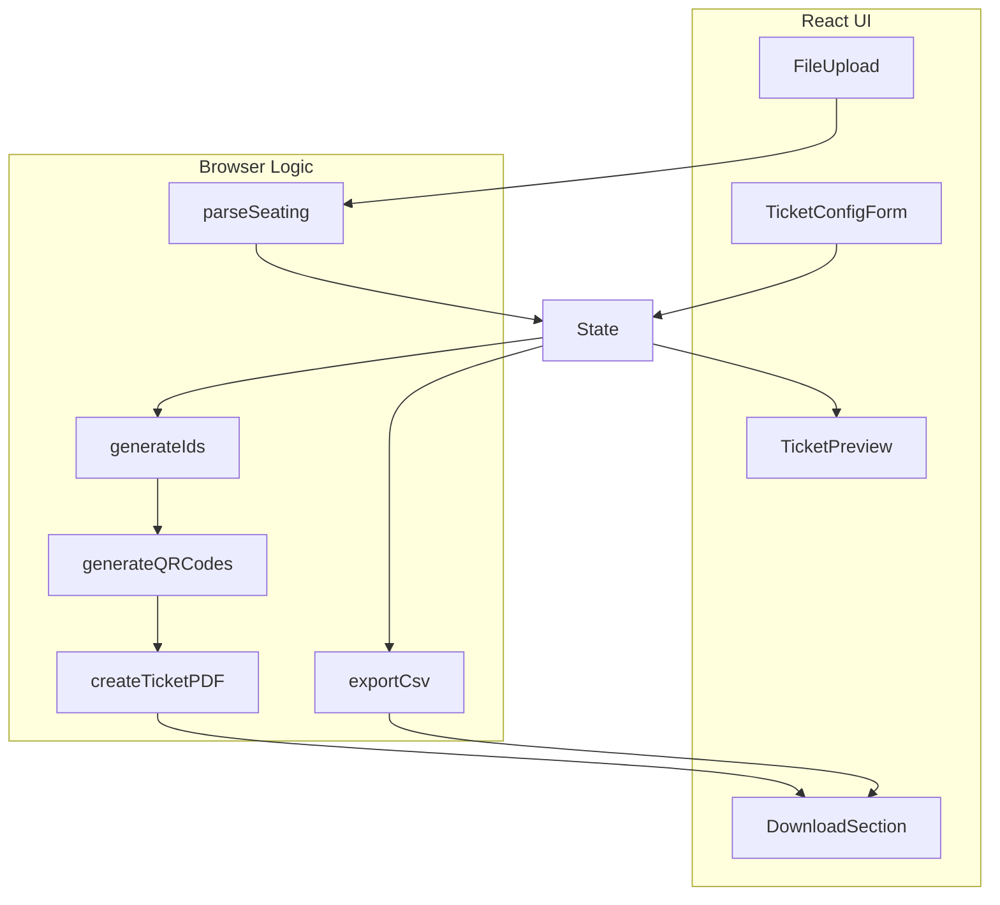

# QR Ticket Generator SPA Conversion

## Architecture Overview

## Key Refactoring

The existing logic in `src/` uses Node.js APIs (fs, streams). We'll create browser-compatible versions:| Current File | Change Required ||--------------|-----------------|| [`parseSeating.ts`](src/parseSeating.ts) | Keep `parseSeating(content: string)` as-is, remove fs-dependent `parseSeatingFile()` || [`generateIds.ts`](src/generateIds.ts) | Works as-is (`crypto.randomUUID()` is browser-compatible) || [`generateQRCodes.ts`](src/generateQRCodes.ts) | Use `QRCode.toDataURL()` instead of `toBuffer()` || [`createTicketPDF.ts`](src/createTicketPDF.ts) | Rewrite using `pdf-lib` (browser-compatible) instead of `pdfkit` || [`exportCsv.ts`](src/exportCsv.ts) | Generate CSV string manually, return as blob |

## Implementation Steps

### 1. Create browser-compatible core modules

Create new files in `src/lib/` for browser logic:

- `src/lib/generateQRCodes.ts` - QR generation returning data URLs
- `src/lib/createTicketPDF.ts` - PDF generation using pdf-lib, returning Uint8Array blobs
- `src/lib/exportCsv.ts` - CSV string generation
- `src/lib/downloadUtils.ts` - Utilities for triggering blob downloads

### 2. Build the React UI

Single page with these sections:

- **Event Config Form**: Artist, date, time, venue, category, staticText, includeQrCode toggle
- **File Upload**: Drag-drop or click to upload seating .txt file
- **Preview**: Show parsed ticket count and sample data
- **Generate Button**: Triggers ID, QR, and PDF generation
- **Downloads**: Individual PDF download buttons + CSV download button

### 3. State Management

Use React `useState` for simplicity:

- `config`: Event configuration from form
- `seatingData`: Parsed seat info from uploaded file
- `tickets`: Generated ticket data with UUIDs
- `qrCodes`: Generated QR code data URLs
- `pdfBlobs`: Generated PDF blobs (array)
- `csvBlob`: Generated CSV blob
- `isGenerating`: Loading state

### 4. Dependencies to Add